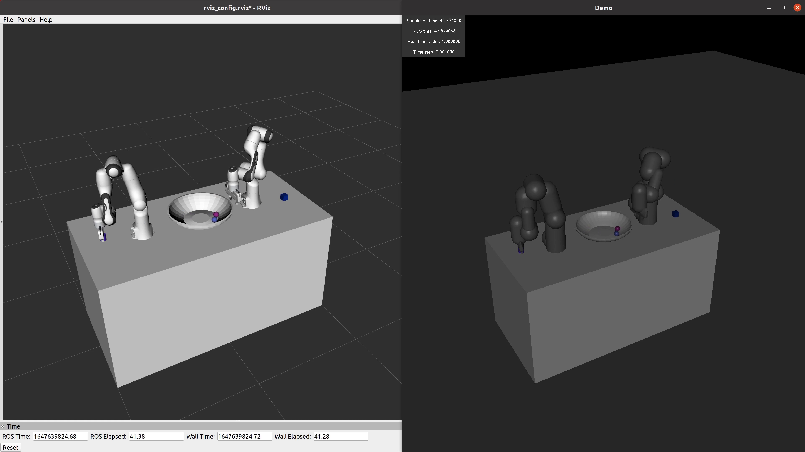

# mujoco_sim
ROS interface for Mujoco simulator

## Overview

## Features
- Advanced physics engine from https://mujoco.org/
- Import and export of **URDF** and **MJCF**
- Integration of controller interfaces, controller managers and hardware interfaces from http://wiki.ros.org/ros_control
- Integrate PD computed-torque control to ensure stability
- Spawn objects in run-time
- Synchronize simulation time and real time (the simulation time can also be set to speed up or slow down)
- Visualize everything from Mujoco to rviz
