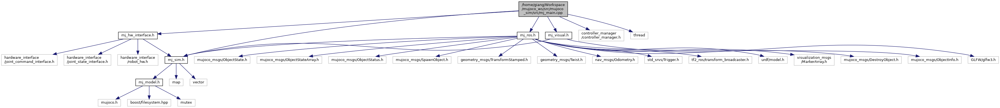

# mujoco_sim
ROS interface for MuJoCo simulator

## Overview

[](https://user-images.githubusercontent.com/64316740/159088750-e9e4d239-81d0-4d99-bae5-8b5e348bfe07.mp4)

[](https://user-images.githubusercontent.com/64316740/165394434-81d07b3c-af3e-48f4-b483-2a72927c6ef8.mp4)

## Features
- Advanced physics engine from https://mujoco.org/
- Import and export of **URDF** and **MJCF**
- Integration of controller interfaces, controller managers and hardware interfaces from http://wiki.ros.org/ros_control
- Integrate PD computed-torque control to ensure stability
- Spawn objects and destroy objects in run-time using rosservice
- Synchronize simulation time and real time (the simulation time can also be set to speed up or slow down)
- Visualize everything from MuJoCo to rviz
- Provide velocity controller for the base
- Support mimic joints from **URDF**

## Installation
1) Create a workspace
```
source /opt/ros/<ros-version>/setup.bash    # source ROS
mkdir -p ~/mujoco_ws/src                    # create directory for workspace
```
2) Initialize the workspace from this [file](https://raw.githubusercontent.com/HoangGiang93/mujoco_ws/main/noetic.rosinstall) and update the workspace
```
wstool init ~/mujoco_ws/src                 # initialize .rosinstall
wstool merge -t ~/mujoco_ws/src https://raw.githubusercontent.com/HoangGiang93/mujoco_ws/main/noetic.rosinstall
wstool update -t ~/mujoco_ws/src            # pull the repositories
```
3) Install dependency of all packages in the workspace
```
rosdep install --ignore-src --from-paths .  # install dependencies available through apt
```
4) Build packages
```
cd ~/mujoco_ws                              # go to the workspace directory
catkin_make                                 # build packages (or catkin build)
source ~/mujoco_ws/devel/setup.bash         # source new overlay
```

## Quick start
1) Import robot from **URDF**

[](https://user-images.githubusercontent.com/64316740/159138084-c8cad813-6d55-4dab-874d-82870c793484.mp4)

2) Control the robot

mujoco_sim integrates hardware interfaces from http://wiki.ros.org/ros_control. Currently only **effort-based joints** are supported, so PID gains are required. It's recommended to set the parameters as ```{p: 2000, i: 100, d: 50}```

Here are some examples:
- Joint position controller
  - Include `ur_pos_control.launch` in the launch file `ur5_display.launch`, then launch it
```
roslaunch ur_mujoco ur5_display.launch        # Show up everything
rosrun ur_control test_joint_pos_publisher.py # Run a test
```
[](https://user-images.githubusercontent.com/64316740/159139781-3c3bc83f-d6df-46ac-a679-e7591d252b85.mp4)

- Joint velocity controller
  - Include `ur_vel_control.launch` in the launch file `ur5_display.launch`, then launch it
```
roslaunch ur_mujoco ur5_display.launch        # Show up everything
rosrun ur_control test_joint_vel_publisher.py # Run a test
```
[](https://user-images.githubusercontent.com/64316740/159139857-8beef478-e300-44c8-86b1-e1d28ce41519.mp4)

- Joint trajectory controller (using [test_trajectory](https://github.com/PickNikRobotics/ros_control_boilerplate/blob/noetic-devel/src/tools/test_trajectory.cpp) from http://wiki.ros.org/ros_control_boilerplate)
  - Include `ur_traj_control.launch` in the launch file `ur5_display.launch`, then launch it
```
roslaunch ur_mujoco ur5_display.launch          # Show up everything
roslaunch ur_control ur_test_trajectory.launch  # Run a test
```
[](https://user-images.githubusercontent.com/64316740/159139999-4913c350-a5e7-4218-973d-2e73525f06cd.mp4)

- Cartesian trajectory controller (using [giskard](http://giskard.de/wiki:tutorials), a cool framework for constraint- and optimization-based robot motion control, which is **highly recommended**)
  - Include `franka_traj_control.launch` in the launch file `panda_arm_display.launch`, then launch it
```
roslaunch franka_mujoco panda_arm_display.launch          # Show up everything
roslaunch giskardpy giskardpy_panda_arm.launch            # Run giskard
```
[](https://user-images.githubusercontent.com/64316740/159140897-b5781e0e-e5e6-4473-89ef-03b5c79241c4.mp4)

- Run the whole pick-and-place demo (using [giskard](http://giskard.de/wiki:tutorials), please update the following [.rosinstall](https://raw.githubusercontent.com/HoangGiang93/mujoco_ws/main/giskard.rosinstall))
```
wstool merge -t ~/mujoco_ws/src https://raw.githubusercontent.com/HoangGiang93/mujoco_ws/main/giskard.rosinstall
wstool update -t ~/mujoco_ws/src
catkin build
roslaunch franka_mujoco dual_panda_arm_demo.launch
```
## Software architecture

